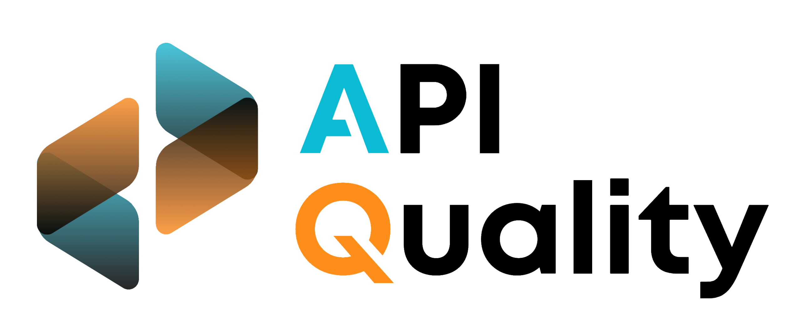

# 🍩 ApiGen [](https://dotnet.microsoft.com/en-us/download/dotnet/8.0) [](https://github.com/mkenney/software-guides/blob/master/STABILITY-BADGES.md#alpha) [](https://www.gnu.org/licenses/lgpl-3.0)





 [](https://sonarqube.cloudappi.net/dashboard?id=apitools-apigen-dotnet) [](https://sonarqube.cloudappi.net/dashboard?id=apitools-apigen-dotnet) [](https://sonarqube.cloudappi.net/dashboard?id=apitools-apigen-dotnet) [](https://sonarqube.cloudappi.net/dashboard?id=apitools-apigen-dotnet)
 


`Asp.Net microservice` archetype generator in dotnet with hexagonal architecture based on an openapi document with extended annotations. This project is a wrapper of the [java apigen](https://github.com/apiaddicts/apigen.springboot) with springboot but using dotnet and adapting some concepts due to the paradigm difference. The project is currently being developed by the [CloudAPPi Services](https://cloudappi.net).


[](https://api-gateway.apiquality.io/api-apigen-dotnet/v1/swagger)
[](https://gitlab.com/cloudappi/templates/back-templates/dotnet-template)

# ▶️ How to start

## `cli` dotnet
```
dotnet run --project ./src/Api/Api.csproj
```

## `docker`
```
docker build -t apigen .
docker run -d -p 1000:80 --name apigen.net apigen
```

## `docker-compose`
```
 docker-compose up --build -d
```

# ▶️ Usage
## Api
if you start your application you can directly access `/swagger` to see the documentation. You can also call the generation endpoint directly with a curl, you have some examples in the `src/Generator/Examples` folder

### _example api-hospital.yaml_
```
curl -X 'POST' \
  '{{url}}/generator/file' \
  -H 'accept: */*' \
  -H 'Content-Type: multipart/form-data' \
  -F 'file=@<openapi-file>'
```

## Command
Compiling the `Command` project or downloading the build

```
> apigen <openapi-path>
```

## ⏩ Next Steps
### 💿 ORM

The generation of the orm through special tags in openapi still generates problems but you can integrate the automatically generated code using the orm provided by entity framework. This generates the database context and the necessary entities.

```
dotnet tool uninstall dotnet-ef -g
dotnet tool install --global dotnet-ef
dotnet ef dbcontext scaffold <db_conexion> <driver> -o <output>
```
_example generate with `PostgreSQL`_
```
dotnet ef dbcontext scaffold "Host=<url>:<port>;Database=<db>;Username=<user>;Password=<pass>" Npgsql.EntityFrameworkCore.PostgreSQL -o Infrastructure
```